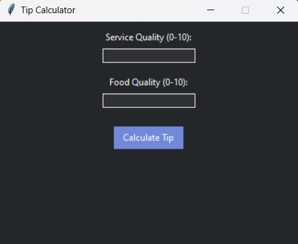

# Fuzzy-Tip-System 💸

A simple **Tip Calculator** application built with Python and Tkinter. This project allows users to enter their service and food quality ratings (from 0 to 10) and calculates the recommended tip based on fuzzy logic principles.

## Features 🌟
This is how the application works, the first input field to represent the **Service Quality**, and the second one for the **Food Quality**, and simply by clicking at the **Calculate Button**, it will run the Crisp input data into a complete **Fuzzy System** to calculate the final Crisp output.

- **Service and Food Quality Input**: Users can rate the quality of service and food on a scale from 0 to 10.
- **Calculate Tip**: Based on fuzzy logic rules, the application calculates an appropriate tip percentage.

## How It Works ⚙️

1. **User Inputs**: The user provides ratings for service and food quality.
2. **Fuzzification**: These inputs are fuzzified using membership functions, categorizing the ratings (e.g., poor, good, excellent).
3. **Rule Evaluation**: Using fuzzy logic, rules are applied to determine whether the tip should be "cheap," "average," or "generous."
4. **Defuzzification**: The final tip amount is calculated based on the fuzzy output and displayed to the user.

